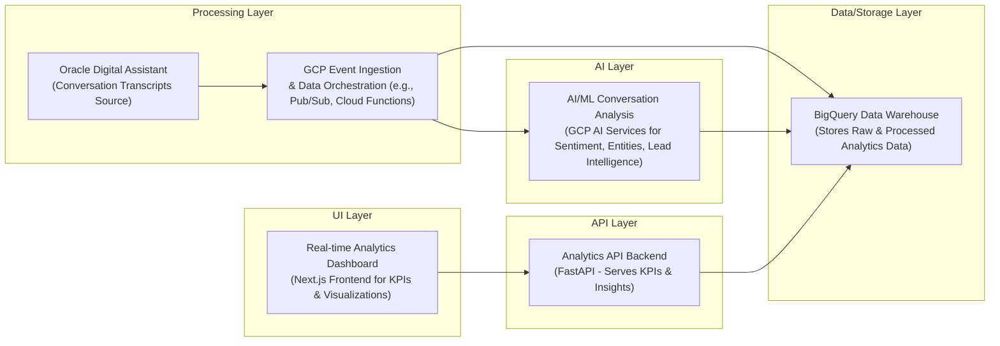

# Costco Agent Assist

## Overview
Costco Agent Assist is a GCP-native solution designed for post-call analytics and business intelligence specifically for Costco's Oracle Digital Assistant interactions. This project provides AI-powered sentiment analysis, lead intelligence, and real-time conversation metrics to significantly enhance customer service operations and identify valuable business opportunities. It represents a comprehensive analytics solution built entirely on Google Cloud Platform (GCP) to deliver actionable insights from conversational data.

## Business Problem
Costco faces the challenge of extracting meaningful insights from the vast volume of customer interactions handled by its Oracle Digital Assistant. Without a robust post-call analytics system, it's difficult to:
- Accurately gauge customer satisfaction and understand sentiment trends.
- Proactively identify potential sales leads or business opportunities for specialized teams like the Business Center.
- Pinpoint common customer issues, product-related feedback, or knowledge gaps within the support ecosystem.
- Lack real-time visibility into conversation performance, hindering data-driven decision-making for continuous improvement in customer service.

This solution addresses these gaps by transforming raw conversational data into structured, actionable business intelligence.

## Key Capabilities
-   **Real-Time Analytics Dashboard**: Provides an intuitive dashboard with Key Performance Indicators (KPIs), sentiment trends, resolution rates, and other essential conversation metrics for immediate operational insights.
-   **AI-Powered Insights**: Leverages Google Vertex AI (specifically Gemini) for advanced sentiment analysis, comprehensive topic extraction, entity recognition (e.g., products, locations), and accurate intent classification from customer conversation transcripts.
-   **Lead Intelligence**: Automatically identifies and scores business opportunities from customer interactions, enabling proactive engagement for teams like the Business Center (e.g., bulk purchase interest, premium product inquiries).
-   **Trend Analysis**: Offers historical data analysis with visualizations to track changes in customer sentiment, common issues, and service performance over specified periods.
-   **Product Insights**: Monitors which specific products generate support requests, analyzes associated customer sentiment, and uncovers potential cross-sell/upsell opportunities.
-   **Conversation Metrics**: Tracks key operational data such as total conversation volume by time period, average conversation duration, peak interaction times, and channel distribution.
-   **Performance Metrics**: Reports on critical support metrics including resolution rate, customer satisfaction rate, average handling time, and helps identify knowledge base deficiencies.

## Tech Stack
-   **Cloud Platform**: Google Cloud Platform (GCP)
-   **Primary Languages**: JavaScript (frontend), Python (backend/serverless functions)
-   **Frontend Framework**: Next.js
-   **Data Warehousing**: Google BigQuery
-   **AI/ML Services**: Google Vertex AI (Gemini for generative AI analysis), Google Speech-to-Text (for voice transcription)
-   **Serverless Compute**: Google Cloud Functions (for ETL and AI processing of transcripts), Google Cloud Run (for hosting the Next.js application)
-   **Storage**: Google Cloud Storage (for raw transcript storage and data staging)
-   **CLI/Tools**: `gcloud` CLI, `npm`, `bq` CLI

## Repository Structure

```
.
├── app/                              # Next.js frontend application (Agent Assist UI & Analytics Dashboard)
│   ├── api/                          # Backend API routes for data retrieval and processing
│   │   ├── analytics/                # API endpoints for dashboard, leads, and trends data
│   │   │   ├── dashboard/route.js    # Dashboard metrics API
│   │   │   ├── leads/route.js        # Lead intelligence API
│   │   │   └── trends/route.js       # Trends analysis API
│   │   ├── chatbot/route.js          # API for AI assistant (if integrated for real-time assist)
│   │   ├── conversations/route.js    # API for conversation list retrieval
│   │   └── transcript/route.js       # API for individual transcript retrieval
│   ├── analytics/page.js             # Analytics dashboard UI components
│   ├── page.js                       # Main Agent Assist UI page (if present)
│   └── layout.js                     # Global layout for the Next.js application
├── analytics-processor/              # Google Cloud Function for post-call analytics processing
│   ├── main.py                       # Main Python script for the Cloud Function (entry-point: process_transcript)
│   └── requirements.txt              # Python dependencies for the Cloud Function
├── bigquery/                         # BigQuery schema definitions and setup scripts
│   └── setup.sql                     # SQL script to create BigQuery datasets, tables, and views
├── main.py                           # (Optional) Script for audio transcription or other utility functions
├── ANALYTICS_ARCHITECTURE.md         # Detailed documentation on the project architecture
├── DEPLOYMENT.md                     # Comprehensive guide for deploying the project to GCP
├── package.json                      # Node.js project dependencies and scripts for the frontend
└── cloudbuild.yaml                   # Google Cloud Build configuration for CI/CD pipelines
```

## Local Setup
To set up and run the Costco Agent Assist project locally, follow these steps:

### Prerequisites
-   **GCP Project**: An active Google Cloud Platform project (e.g., `arcane-rigging-473104-k3`). Ensure billing is enabled.
-   **Node.js**: Version 18+ (includes `npm`).
-   **Python**: Version 3.11+.
-   **Google Cloud CLI (`gcloud`)**: Installed and authenticated to your GCP project.
    -   `gcloud auth login`
    -   `gcloud config set project [YOUR_GCP_PROJECT_ID]`

### Steps
1.  **Clone the Repository:**
    ```bash
    git clone https://github.com/ramamurthy-540835/costco-agent-assist.git
    cd costco-agent-assist
    ```

2.  **Set Up BigQuery:**
    Execute the SQL script to create the necessary BigQuery datasets and tables for analytics:
    ```bash
    bq query --use_legacy_sql=false < bigquery/setup.sql
    ```
    This will create tables to store conversation transcripts, sentiment analysis results, and lead intelligence data.

3.  **Deploy Analytics Processor (Cloud Function):**
    The `analytics-processor` is a Cloud Function that triggers upon new transcript files in Cloud Storage, processes them using Vertex AI, and loads results into BigQuery.
    ```bash
    cd analytics-processor
    gcloud functions deploy costco-analytics-processor \
      --gen2 \
      --runtime=python311 \
      --region=us-central1 \
      --source=. \
      --entry-point=process_transcript \
      --trigger-bucket=service-ticket \
      --timeout=540s \
      --set-env-vars PROJECT_ID=arcane-rigging-473104-k3 # Replace with your project ID
    cd ..
    ```
    *Ensure the `service-ticket` Cloud Storage bucket exists and is configured to receive Oracle Digital Assistant transcripts.*

4.  **Run the Application Locally (Next.js Frontend):**
    Install frontend dependencies and start the development server:
    ```bash
    npm install
    npm run dev
    ```
    The application will be accessible via your web browser:
    -   **Agent Assist UI**: `http://localhost:3000`
    -   **Analytics Dashboard**: `http://localhost:3000/analytics`

## Deployment
This project is designed for deployment on Google Cloud Platform, leveraging serverless services for scalability and ease of management.

1.  **Ensure Analytics Processor is Deployed:**
    Confirm the `costco-analytics-processor` Cloud Function is deployed as described in [Local Setup](#local-setup) Step 3. This function handles the backend data processing pipeline.

2.  **Deploy the Next.js Application to Cloud Run:**
    From the root directory of the repository, deploy the frontend application using Cloud Run. This command builds a container image and deploys it as a serverless service.
    ```bash
    gcloud run deploy agent-assist-ui \
      --source . \
      --region us-central1 \
      --allow-unauthenticated # Adjust for production authentication requirements
    ```
    Upon successful deployment, the `gcloud` CLI will provide a URL for the deployed application.

    **Example Production URLs:**
    -   **Agent Assist UI**: `https://agent-assist-ui-208156119451.us-central1.run.app`
    -   **Analytics Dashboard**: `https://agent-assist-ui-208156119451.us-central1.run.app/analytics`

    For automated deployments, the `cloudbuild.yaml` file is configured to work with Google Cloud Build, enabling CI/CD pipelines.

## Demo Workflow
The Agent Assist Analytics Dashboard showcases several key scenarios for leveraging conversational intelligence:

1.  **Daily Operations Dashboard:**
    -   **Goal**: Get an immediate pulse on the day's customer service performance.
    -   **Action**: Navigate to the Analytics Dashboard (e.g., `http://localhost:3000/analytics`).
    -   **Observation**: View real-time KPIs such as total conversation volume, average sentiment score, and top identified issues for the current day. Identify any unusual spikes or dips in metrics.

2.  **Lead Intelligence for Business Center:**
    -   **Goal**: Uncover potential sales opportunities for Costco's Business Center.
    -   **Action**: Go to the "Leads" section of the Analytics Dashboard. Filter for 'new' leads and sort by 'lead score'.
    -   **Observation**: Review summarized conversations where customers expressed high interest in bulk purchases, specific high-value products, or business-specific services. This provides actionable intelligence for the Business Center team to follow up.

3.  **Quality Insights for Agent Performance & Training:**
    -   **Goal**: Evaluate agent performance, identify training needs, and improve knowledge base content.
    -   **Action**: Access the "Trends" view to analyze historical resolution rates and customer satisfaction scores. Drill down into specific conversations flagged with low sentiment or long handling times.
    -   **Observation**: Pinpoint areas where agents might need additional training, or where knowledge articles could be enhanced to better address customer queries.

4.  **Product Analytics:**
    -   **Goal**: Understand customer sentiment and support demand related to specific products.
    -   **Action**: Use the dashboard's filtering capabilities to isolate conversations mentioning particular products (e.g., "smart appliances", "organic produce").
    -   **Observation**: Analyze the aggregated sentiment for those products, identify common problems, and detect emerging trends that can inform product development or marketing strategies.

## Future Enhancements
-   **Direct Oracle Digital Assistant Integration**: Develop a more streamlined, automated pipeline for ingesting transcripts directly from Oracle Digital Assistant into Cloud Storage, reducing manual intervention.
-   **Advanced Sentiment & Topic Modeling**: Fine-tune Vertex AI models with Costco-specific jargon and product catalogs to achieve even higher accuracy in sentiment analysis and topic extraction.
-   **Proactive Alerting**: Implement real-time alerts for critical events, such as a sudden drop in overall customer sentiment, significant increase in unresolved issues, or detection of high-priority leads.
-   **Customizable Dashboards**: Allow users to create and save personalized dashboard views, choosing relevant KPIs and visualizations specific to their roles and analytical needs.
-   **Agent Performance Leaderboards**: Introduce features to track and visualize individual agent performance based on resolution rates, satisfaction scores, and adherence to best practices.
-   **Enhanced Search & Filtering**: Implement more powerful natural language search capabilities across conversation transcripts and advanced filtering options for detailed data exploration.
-   **Multilingual Support**: Extend AI analysis capabilities to support customer interactions in multiple languages beyond English, catering to a diverse customer base.
-   **Cost Optimization Strategies**: Continuously review and optimize GCP resource utilization to ensure the solution remains cost-effective as usage scales.
## Architecture

GCP-native post-call analytics and business intelligence for Oracle Digital Assistant interactions..



For a standalone preview, see [docs/architecture.html](docs/architecture.html).

### Key Architectural Aspects:
* Leverages Google Cloud Platform services for an entirely cloud-native analytics solution for Oracle Digital Assistant interactions.
* Performs AI-powered sentiment analysis, entity extraction, and lead intelligence on conversation transcripts.
* Features a real-time analytics dashboard for monitoring key performance indicators and identifying business opportunities.
* Utilizes BigQuery as a central data warehouse for storing both raw conversation data and rich analytical insights.
